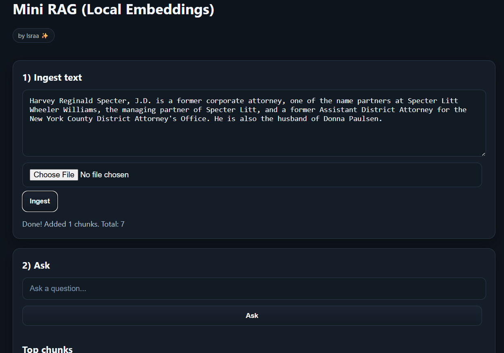

# Mini RAG App (Local + Ollama)

[](#)
[](#)
[](#)
[](#)
[](#)

A minimal Retrieval-Augmented Generation (RAG) demo:
- **Local multilingual embeddings** (Xenova)
- **Local LLM** via **Ollama (llama3.2)**
- Ingest text → retrieve with cosine → generate with citations
- **Persistence to disk** (`data/memory.json`)
- Simple web UI (dark, card style)



## Run
```bash
npm install
npm start
# open http://localhost:3000

Features

Paste text or Import .txt → chunk → embed → store

Ask questions; shows Top chunks and Answer with [#[ref]] citations

Export memory (JSON), Clear memory

Ping button to verify server is alive

## Roadmap
- **PDF ingestion**: add a `/upload-pdf` route using `pdfjs-dist` (v3 legacy) for robust text extraction.
- **Docker**: provide a Dockerfile + `docker-compose.yml` for one-command local runs.
- **Deployment**:
  - **Render**: simple Node deploy for public demos (retrieval + UI).
  - **GPU host for Ollama**: optional remote LLM; otherwise fall back to chunk summary or OpenAI key if available.
- **UI polish**: syntax highlighting, copy button for answers, expand/collapse long chunks.
- **Config**: expose chunk size/overlap via environment variables for easy benchmarking.
